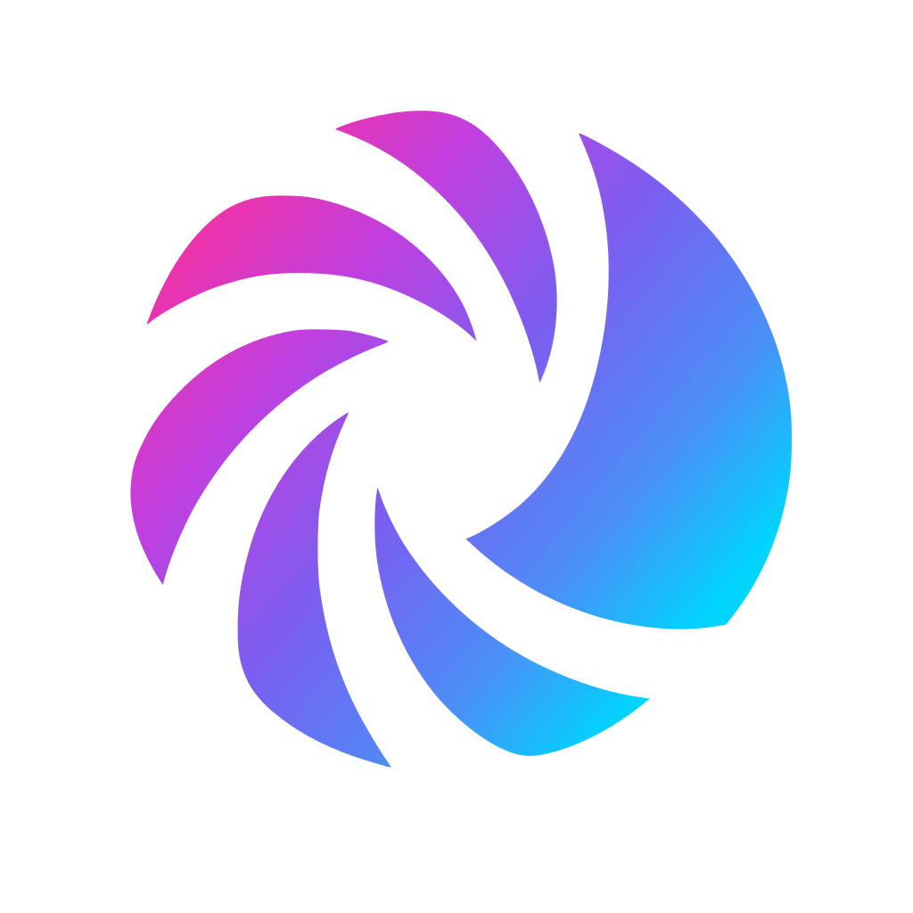
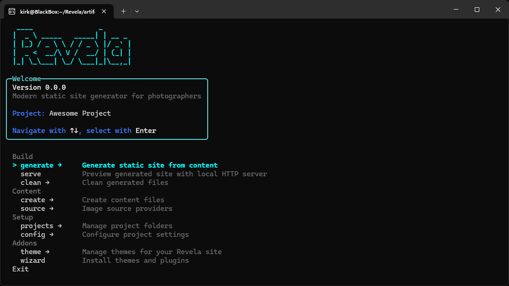

<div align="center">



# Revela

**Reveal your stories through beautiful portfolios**

Modern static site generator for photographers — fast, beautiful output, no quality trade-offs. Built with .NET 10.

[](https://github.com/spectara/revela/actions/workflows/ci.yml)
[](https://opensource.org/licenses/MIT)
[](https://dotnet.microsoft.com/)

🌐 **[revela.website](https://revela.website)** — Documentation & Demo

[Getting Started](https://revela.website/docs/) · [Download](https://github.com/spectara/revela/releases) · [GitHub](https://github.com/spectara/revela)



</div>

---

> [!NOTE]
> **Beta** · active development, breaking changes possible. Versioned releases are available from [GitHub Releases](https://github.com/spectara/revela/releases).

---

## ✨ Features

- **🖼️ Modern Image Formats** — JPEG by default, AVIF and WebP available with one config flag (off by default because they're CPU-heavy to encode). Responsive sizes and CSS-only LQIP placeholders included.
- **🧙 Interactive Wizards** — Project setup, theme picker, plugin install — no manual config files.
- ** Plugin System** — Compress, Serve, Statistics, Calendar, Source.OneDrive, Source.Calendar.
- **🎨 Themes** — Lumina (+ Statistics and Calendar extensions). Customize via overrides instead of forking.
- **⚡ Fast** — Powered by libvips (NetVips), parallel processing, change detection.
- **📊 Lighthouse-friendly** — [photo.kirk.one](https://photo.kirk.one) (built with Revela) scores 100/100/100/100 with FCP 0.2 s, LCP 0.3 s, zero blocking time, zero layout shift.

---

## 🚀 Quick Start

### 1. Download & Run

Grab the [Standalone build](https://revela.website/pages/downloads/) for your platform from the [Releases](https://github.com/spectara/revela/releases) page — a single self-contained binary, no .NET SDK needed.

- **Windows:** unzip and double-click `revela.exe`
- **macOS / Linux:** extract and run `./revela` (or use the included launcher script)

The interactive wizard walks you through the rest.

### 2. Create a Project

The project wizard appears automatically and asks for:

1. **Project settings** — Name and URL
2. **Theme selection** — Choose your look
3. **Image settings** — Default is JPEG only (AVIF and WebP can be flipped on later in `project.json`)
4. **Site metadata** — Title, author, copyright

### 3. Add Photos

Create folders in `source/` — folder names become gallery titles:

```
source/
├── 01 Weddings/
│   └── *.jpg
├── 02 Portraits/
│   └── *.jpg
└── 03 Landscapes/
    └── *.jpg
```

### 4. Generate

Select **generate** → **all** from the menu (or run `revela generate all`):

```
Processing images [████████████████████] 100% 47/47
Rendering pages   [████████████████████] 100% 12/12

✓ Generation complete!
```

### 5. Preview

```bash
revela serve
```

Opens your browser with a live preview. The Serve plugin ships built-in with the Standalone build; for the modular Full / .NET Tool builds, install it once with `revela plugin install Spectara.Revela.Plugins.Serve`.

---

## 📦 Installation Options

| Method | Best For | Where |
|--------|----------|-------|
| **Standalone** | Most users — single binary, all plugins built in | [Download](https://revela.website/pages/downloads/) |
| **Full** | Want to add custom plugins, manage them via NuGet | [Download](https://revela.website/pages/downloads/) |
| **.NET Tool** | You already have the .NET 10 SDK | `dotnet tool install -g Spectara.Revela` |
| **From Source** | Contributors | See [Setup Guide](docs/setup.md) |

**[Detailed Installation Guide →](https://revela.website/docs/get-started/installation/)**

---

## 🔌 Official Plugins

Standalone has all of these built in. Full / .NET Tool installs them on demand:

| Plugin | Description |
|--------|-------------|
| **Compress** | Pre-compress static files with Gzip/Brotli |
| **Serve** | Local dev server with live preview |
| **Statistics** | EXIF statistics page (camera bodies, lenses, focal lengths) |
| **Calendar** | Calendar/timeline pages built from gallery dates |
| **Source.OneDrive** | Import from OneDrive shared folders |
| **Source.Calendar** | Import events from iCal feeds |

```bash
revela plugin install Spectara.Revela.Plugins.Serve
```

And three theme packages: **Lumina** (default), **Lumina.Statistics**, **Lumina.Calendar**.

---

## 📖 Documentation

Visit **[revela.website/docs](https://revela.website/docs/)** for the full documentation:

- **[Source Structure](https://revela.website/docs/guide/source-structure/)** — Organize photos with galleries or filters
- **[Filter Galleries](https://revela.website/docs/guide/filtering/)** — Dynamic galleries with EXIF queries
- **[Sorting](https://revela.website/docs/guide/sorting/)** — Configure image and gallery order
- **[Creating Pages](https://revela.website/docs/guide/pages/)** — Gallery, text, and statistics pages
- **[Theme Customization](https://revela.website/docs/guide/themes/)** — Extract and customize themes

**Offline/GitHub:** [docs/](docs/) folder contains the same documentation in Markdown.

## 🛠️ For Developers

Want to build a plugin, create a theme, or understand how Revela works internally? The **[developer documentation](docs/)** lives right here in the repo, next to the code:

- **[Plugin Development](docs/plugin-development.md)** — build, configure, test, and publish a plugin
- **[Plugin System](docs/plugin-system-v2.md)** — architecture and design
- **[Security Model](docs/security-model.md)** — trust assumptions and URL-safety guardrails
- **[Architecture](docs/architecture.md)** · **[Project Structure](docs/project-structure.md)** · **[Development Guide](docs/development.md)**

Build from source:

```bash
git clone https://github.com/spectara/revela.git
cd revela
dotnet build
dotnet run --project src/Cli
```

**[Setup Guide →](docs/setup.md)**

---

## 🤝 Contributing

Contributions welcome! Please open an [issue](https://github.com/spectara/revela/issues) or pull request.

## 📄 License

[MIT License](LICENSE)

## 🙏 Acknowledgments

- [Expose](https://github.com/Jack000/Expose) by Jack Rugile — the original Bash-based static gallery generator that started this whole idea
- [Expose (fork)](https://github.com/kirkone/Expose) — the predecessor of this project, also Bash-based
- [libvips](https://www.libvips.org/) — image processing
- [Scriban](https://github.com/scriban/scriban) — templates
- [CSS-only LQIP](https://leanrada.com/notes/css-only-lqip/) — blur placeholder technique by Lean Rada

---

<div align="center">

**[⬆ Back to top](#revela)**

</div>

