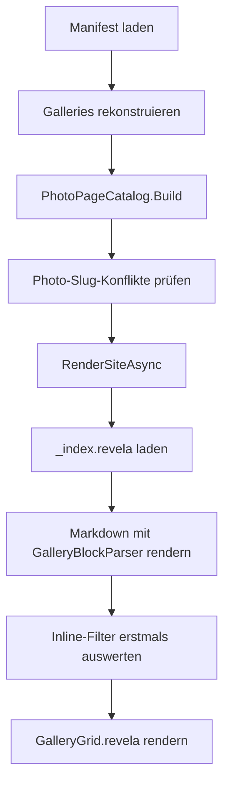
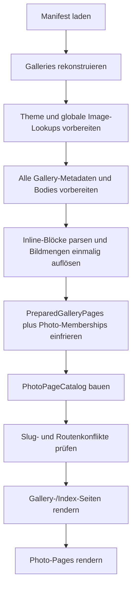

# Übergabe: Inline-Galerien fertigstellen und mit Photo-Pages verzahnen

> **Stand:** 2026-08-27
> **Status:** Abgeschlossen
> **Ergebnis:** Preparation, Photo-Memberships, occurrence-genaue Anker, Diagnosen und
> `filter -> sort -> limit` sind implementiert. Die dauerhafte Dokumentation steht in
> [`docs/inline-galleries.md`](../inline-galleries.md).

## Auftrag

Die bestehende Implementierung von `[[gallery]]` und `[[gallery: <filter>]]` soll nicht neu
erfunden, sondern vervollständigt werden. Der Markdig-Blockparser, die globale Filterauflösung,
das Theme-Partial und das `has_inline_galleries`-Flag funktionieren grundsätzlich und sollen
beibehalten werden.

Zu erledigen sind insbesondere:

1. Kaputte Links von Inline-Grids auf nicht erzeugte `/photo/.../`-Seiten beseitigen.
2. Inline-Grid-Ergebnisse vor der Photo-Page-Aggregation einmalig auflösen und einfrieren.
3. Die im Design Record beschlossene Kontextsemantik für nackte und gefilterte Grids umsetzen.
4. Fehlerhafte Tokens und semantisch ungültige Filter mit Datei, Zeile und Filterposition melden.
5. Die vereinbarte Reihenfolge `filter -> effektiver sort -> limit` herstellen.
6. Vorkommensgenaue Anker für Bilder in mehreren Grids erzeugen.
7. Fehlende Regressionstests und Produkt-/Theme-Dokumentation ergänzen.

Der ausführliche ursprüngliche Design Record liegt in
[inline-galleries.md](inline-galleries.md). Dessen Entscheidungen D1-D7 und Edge Cases E1-E7
sind weiterhin die fachliche Grundlage. Der Statuskopf dieses Dokuments ist inzwischen veraltet:
Das MVP ist implementiert, aber noch nicht vollständig mit Photo-Pages verzahnt.

## Kurzfassung des aktuellen Zustands

### Bereits gut umgesetzt

- Eigener Markdig-Blockparser, kein Regex- oder Body-Split.
- Syntax `[[gallery]]` und `[[gallery: <filter>]]`.
- Nur alleinstehende Top-Level-Blöcke werden erkannt.
- Codeblöcke, Inline-Code, Listen, Blockquotes und Escapes bleiben Literaltext.
- Nacktes Token verwendet die bereits berechnete Seitenmenge.
- Gefiltertes Token arbeitet auf `IManifestRepository.Images` und damit auf dem globalen,
  kanonischen `ImageContent`-Pool.
- Filterung erfolgt vor `ImageContent -> Image`.
- `Gallery.Body` bleibt fertiges HTML; das Template-Modell `images` wird nicht geleert oder
  umgedeutet.
- `Gallery.HasInlineGalleries` unterdrückt das automatische Trailing-Grid im Theme.
- `Partials/GalleryGrid.revela` wird lazy nur bei tatsächlicher Token-Nutzung verlangt.
- Leere Treffermengen und mehrere nackte Tokens erzeugen Build-Warnungen.
- Kein Token liefert nachweislich dasselbe Markdown-HTML wie vor dem Feature.

### Noch nicht vollständig umgesetzt

- Inline-Grids sind keine Eingabe für `PhotoPageCatalog`.
- Gefilterte Inline-Grids erhalten keinen eigenen Photo-Context.
- Custom-Body-Seiten erzeugen Links auf Photo-Pages, obwohl diese Seiten nicht existieren.
- Vorkommensgenaue Grid-/Bildanker fehlen.
- Fehlerhafte top-level Tokens können als sichtbarer Text durchrutschen.
- Semantische Filterfehler verlieren Datei und Zeile.
- `limit` ohne expliziten Sort nutzt Manifestreihenfolge statt effektivem Gallery-/Global-Sort.
- Öffentliche Dokumentation und Theme-Vertrag sind nicht aktualisiert.

## Aktueller Codepfad

Die wichtigsten Dateien:

| Bereich                      | Datei                                                                                                           |
| ---------------------------- | --------------------------------------------------------------------------------------------------------------- |
| Markdig-Registrierung        | [`GalleryBlockExtension.cs`](../../src/Features/Generate/Services/GalleryBlockExtension.cs)                     |
| Blockparser                  | [`GalleryBlockParser.cs`](../../src/Features/Generate/Services/GalleryBlockParser.cs)                           |
| Blockmodell                  | [`GalleryBlock.cs`](../../src/Features/Generate/Services/GalleryBlock.cs)                                       |
| Blockrenderer                | [`GalleryBlockRenderer.cs`](../../src/Features/Generate/Services/GalleryBlockRenderer.cs)                       |
| Verschachtelte Token-Warnung | [`GalleryTokenWarningInlineParser.cs`](../../src/Features/Generate/Services/GalleryTokenWarningInlineParser.cs) |
| Page-lokaler Kontext         | [`GalleryBlockContext.cs`](../../src/Features/Generate/Services/GalleryBlockContext.cs)                         |
| Globaler Filterresolver      | [`GalleryImageResolver.cs`](../../src/Features/Generate/Services/GalleryImageResolver.cs)                       |
| Markdown-Pipeline            | [`MarkdownService.cs`](../../src/Features/Generate/Services/MarkdownService.cs)                                 |
| Render-Wiring                | [`RenderService.cs`](../../src/Features/Generate/Services/RenderService.cs)                                     |
| Photo-Aggregation            | [`PhotoPageCatalog.cs`](../../src/Features/Generate/Infrastructure/PhotoPageCatalog.cs)                         |
| Photo-Kontext                | [`PhotoContext.cs`](../../src/Features/Generate/Models/PhotoContext.cs)                                         |
| Gallery-Flag                 | [`Gallery.cs`](../../src/Features/Generate/Models/Gallery.cs)                                                   |
| Standard-Grid                | [`Body/Gallery.revela`](../../src/Themes/Lumina/Body/Gallery.revela)                                            |
| Inline-Grid                  | [`Partials/GalleryGrid.revela`](../../src/Themes/Lumina/Partials/GalleryGrid.revela)                            |
| Bildvorkommen                | [`Partials/Image.revela`](../../src/Themes/Lumina/Partials/Image.revela)                                        |

Der derzeitige Ablauf ist:



Das Problem ist die zeitliche Reihenfolge: `PhotoPageCatalog.Build` läuft, bevor `_index.revela`
geladen und bevor irgendein Inline-Grid erkannt oder gefiltert wurde. Der Photo-Katalog kann die
Inline-Vorkommen daher prinzipiell nicht kennen.

## P0: Bestätigter Fehler mit kaputten Photo-Links

### Reproduktion

Das offizielle Website-Sample verwendet auf der Homepage:

```toml
template = "home"
filter = "contains(sourcePath, '_images/home/')"
```

und im Body:

```text
[[gallery]]
```

Siehe [`samples/revela-website/source/_index.revela`](../../samples/revela-website/source/_index.revela).

Reproduktion:

```pwsh
Push-Location samples/revela-website
dotnet run --project ../../src/Cli.Embedded -- generate pages
Pop-Location
```

Bestätigtes Ergebnis am 2026-07-24:

```text
Homepage-Fotolinks:       8
Fehlende Zielseiten:      8
Generierte Fotoseiten:    0
```

Die generierte Homepage enthält beispielsweise:

```html
<a href="photo/home/030630/">
```

aber `output/photo/home/030630/index.html` existiert nicht.

### Root Cause

1. `PhotoPageCatalog.Build(galleries)` aggregiert ausschließlich `Gallery.Images`.
2. `PhotoPageCatalog.IsEligible` schließt Custom-Body-Seiten wie `template = "home"` und
   `template = "page"` absichtlich aus.
3. `GalleryGrid.revela` inkludiert trotzdem immer `Image.revela`.
4. `Image.revela` erzeugt immer `page_url(image)` und einen Link auf die kanonische Photo-Page.
5. Es existiert kein per Vorkommen übergebener Zustand wie `PhotoPageAvailable`,
   `PhotoHref` oder `PhotoContextId`.

### Sofortige Sicherheitsinvariante

**Kein gerendertes `href` darf auf eine Photo-Page zeigen, die der aktuelle Build nicht erzeugt.**

Diese Invariante muss durch einen E2E-Test geschützt werden. Eine reine Prüfung, dass HTML
erzeugt wurde oder dass das Grid an der richtigen Stelle steht, reicht nicht.

### Zwischenlösung versus Zielzustand

Eine kleine Zwischenlösung darf pro Bildvorkommen den Photo-Link deaktivieren, wenn keine
Photo-Page existiert. Das beseitigt 404s, erfüllt aber D1 noch nicht.

Die Zielimplementierung soll Inline-Grid-Ergebnisse vor dem Photo-Katalog vorbereiten, damit
berechtigte Inline-Vorkommen selbst Photo-Pages und Kontexte erzeugen können. Nicht einfach alle
Manifestbilder pauschal zu Photo-Pages machen: `_images` kann unveröffentlichte oder nur für
Content-Images gedachte Dateien enthalten.

## Zielsemantik

### Nacktes `[[gallery]]`

- Verwendet exakt die effektive Seitenmenge.
- Auf einer normalen Default-Gallery gehört das Grid zur bestehenden Seitenkette.
- Es erzeugt keinen zweiten, identischen Photo-Context.
- Mehrere nackte Tokens bleiben erlaubt, erzeugen aber weiterhin eine Warnung.
- Derselbe Bildsatz kann visuell mehrfach erscheinen; die Photo-Kette wird nur einmal geführt.

### Gefiltertes `[[gallery: <filter>]]`

- Filtert global aus den kanonischen Manifestbildern.
- Das aufgelöste Ergebnis wird einmalig berechnet und für Rendering und Photo-Katalog eingefroren.
- Auf einer Photo-Page-fähigen Default-Gallery erhält jedes gefilterte Grid eine eigene
  Previous/Up/Next-Kette und einen eigenen Fragment-/Anker-Namespace.
- Zwei gefilterte Grids mit überlappenden Bildern sind zwei unterschiedliche Vorkommen und müssen
  unterschiedliche HTML-IDs sowie unterschiedliche Rücksprungziele erhalten.
- Bis eine `as "..."`-Syntax implementiert wird, darf als sichtbares Kontextlabel der Seitentitel
  verwendet werden. Keine automatische Heading-Inferenz einführen.

### Tokens auf Custom-Body-Seiten

Der bestehende Designentscheid D6 lautet: Tokens dürfen dort Bilder rendern, erzeugen aber keine
Photo-Contexts oder Photo-Pages.

Daraus folgt zwingend:

- Ein Bildvorkommen ohne existierende Photo-Page darf kein Photo-`href` erhalten.
- Das Theme muss das Bild trotzdem vollständig und responsiv darstellen können.
- Wenn ein Bild aufgrund einer anderen, berechtigten Gallery bereits eine kanonische Photo-Page
  besitzt, muss bewusst entschieden werden, ob das Custom-Body-Vorkommen dorthin verlinkt, aber
  ohne eigenen Rücksprungkontext. Empfohlener konservativer MVP: Custom-Body-Inline-Grids sind
  reine Layout-Elemente und nicht verlinkt.

### Leere Treffermenge

- Kein Fehler.
- Kein leeres `<section class="gallery">` ausgeben.
- Build-Warnung mit Datei und Zeile beibehalten.
- Das Vorhandensein des gültigen Tokens setzt weiterhin `HasInlineGalleries = true`, sodass kein
  unerwartetes Trailing-Grid erscheint.

### Ungültige Tokens und Filter

- `\[[gallery]]` bleibt bewusstes Literal.
- Token-artiger Text in Liste/Blockquote bleibt Literal plus Warnung.
- Ein alleinstehender Top-Level-Block, dessen getrimmter Inhalt mit `[[gallery` beginnt, aber
  weder `[[gallery]]` noch `[[gallery: <filter>]]` entspricht, muss den Build abbrechen.
- Syntaxfehler und semantische Fehler müssen Datei, 1-basierte Zeile, Filterausdruck und Position
  enthalten.

Beispiele für harte Fehler:

```text
[[gallery filename == 'photo.jpg']]
[[gallery: ]]
[[gallery: filename == ]]
[[gallery: unknownProperty == 1]]
[[gallery: unknownFunction(filename)]]
```

## Empfohlene Zielarchitektur

### 1. Preparation-Phase vor dem Photo-Katalog

Die Gallery-Metadaten und Inline-Grid-Auswahlen müssen vorbereitet werden, bevor
`PhotoPageCatalog.Build` läuft.

Zielablauf:



Wichtig:

- Die Preparation-Phase darf noch keine Output-Dateien schreiben.
- Fehler müssen vor dem ersten Seiten-Write erkannt werden, soweit praktisch möglich.
- Inline-Filter nicht in Photo-Katalog und HTML-Renderer getrennt erneut auswerten.
- Der globale Pool bleibt `ImageContent`; erst das fertige Ergebnis wird zu `Image` gemappt.

### 2. Privates Prepared-Modell

Das konkrete Modell kann an den Code angepasst werden. Es sollte sinngemäß Folgendes tragen:

```csharp
internal sealed record PreparedGalleryPage(
    Gallery Gallery,
    string? CustomTemplate,
    IReadOnlyDictionary<string, string> DataSources,
    string MetadataBasePath,
    string RawBody,
    IReadOnlyList<PreparedInlineGrid> InlineGrids);

internal sealed record PreparedInlineGrid(
    int DocumentOrder,
    int SourceLine,
    int SourcePosition,
    string AnchorPrefix,
    string? FilterExpression,
    IReadOnlyList<Image> Images,
    bool CreatesPhotoContext);
```

Das ist ein privates Render-Modell, kein Manifestformat und keine öffentliche SDK-API.
`Gallery` soll weiterhin nur den für Templates nötigen Zustand wie `HasInlineGalleries` tragen.

### 3. Markdig nicht durch String-Splitting ersetzen

Der vorhandene `GalleryBlockParser` bleibt die Quelle der Token-Erkennung.

Mögliche Umsetzung:

1. Markdown mit derselben Blockextension parsen.
2. `GalleryBlock`-Knoten in Dokumentreihenfolge sammeln.
3. Filter einmal auflösen und als `PreparedInlineGrid` speichern.
4. Beim späteren HTML-Rendern greift `GalleryBlockRenderer` nur auf die vorbereiteten Ergebnisse
   zu, statt `GalleryImageResolver` erneut aufzurufen.

Falls Markdig-Dokumente nicht sinnvoll über die Preparation- und Render-Phase gehalten werden
können, darf der AST zweimal geparst werden. Entscheidend ist, dass Filterergebnisse nur einmal
berechnet werden und über eine stabile Blockidentität (`SourceSpan.Start` oder Dokumentindex)
zugeordnet sind.

Kein Regex-/Substring-Split des Autoren-Markdowns einführen.

### 4. PhotoPageCatalog auf allgemeine Memberships umstellen

Der Katalog sollte nicht ausschließlich `Gallery` als Kontextquelle kennen. Sinnvoll ist eine
interne, generalisierte Membership-Eingabe, beispielsweise:

```csharp
internal sealed record PhotoMembership(
    string Route,
    string Fragment,
    string ContextId,
    string Label,
    IReadOnlyList<Image> Images,
    bool IsPhysical);
```

Memberships entstehen aus:

- jeder berechtigten Default-Gallery mit ihrer finalen `Gallery.Images`-Reihenfolge;
- jedem gefilterten Inline-Grid auf einer berechtigten Default-Gallery;
- nicht aus einem nackten Token zusätzlich, weil dessen Menge bereits die Gallery-Membership ist;
- nicht aus Custom-Body-Seiten, solange D6 gilt.

`PhotoContext` muss anschließend nicht zwingend `GallerySlug` heißen. Der Design Record empfiehlt
eine Generalisierung auf Route + Fragment + Label. Keine Migration oder Abwärtskompatibilität ist
nötig; das Projekt ist weiterhin Pre-Release.

### 5. Vorkommensgenaue IDs und Links

Das aktuelle `Image.revela` berechnet:

```scriban
anchor_id = 'photo-' + normalized_image_slug
```

Das ist nur pro Bild, nicht pro Vorkommen eindeutig.

Ziel:

- Standard-Gallery-Vorkommen kann den bisherigen stabilen Anker behalten.
- Gefiltertes Grid erhält einen stabilen Grid-Präfix, zum Beispiel `grid-1`.
- Bildanker im gefilterten Grid: `grid-1-photo-{slug}`.
- Photo-Context verweist mit seinem Up-Link genau auf diesen Anker.
- Thumbnail-Link trägt den passenden Photo-Context-Fragmentwert.
- Dasselbe Bild in zwei Grids erzeugt keine doppelten IDs.

Nicht den Bild-Slug selbst verändern: Er ist kanonische Bild-/Photo-Identität. Die
Vorkommensidentität gehört in ein Render-Occurrence-Modell.

### 6. Theme-Vertrag explizit machen

`GalleryGrid.revela` soll nicht nur `images`, sondern pro Bildvorkommen die Information erhalten,
ob und wohin verlinkt werden darf.

Bevorzugt wird ein Render-Occurrence-Modell statt globaler Template-Seiteneffekte:

```text
occurrence.image
occurrence.anchor
occurrence.photo_href
```

`photo_href = null` bedeutet: responsives Bild rendern, aber keinen `<a>`-Wrapper erzeugen.

Damit kann `Image.revela` weiterhin die gemeinsame responsive Bildstruktur liefern, ohne
anzunehmen, dass jedes Bildvorkommen automatisch eine Photo-Page besitzt.

Keine Theme-Lösung verwenden, die nur anhand von `gallery.template` rät: Ein gefiltertes Bild auf
einer grundsätzlich berechtigten Gallery kann trotzdem keine Photo-Page besitzen, wenn es nicht
in den vorbereiteten Memberships enthalten ist. Die Verfügbarkeit muss aus dem fertigen
Photo-Katalog oder dem vorbereiteten Occurrence-Modell kommen.

## Filter-, Sortier- und Limit-Semantik

### Aktueller Fehler

`FilterService.ApplyQuery` führt derzeit aus:

1. optionales Prädikat;
2. optionalen expliziten Pipe-Sort;
3. optionales `Take(limit)`.

Fehlt `| sort`, wird vor `limit` kein Gallery-/Global-Sort angewendet. Das ursprüngliche Beispiel

```text
[[gallery: width > height | limit 6]]
```

wählt daher die ersten sechs Manifesttreffer, nicht die sechs ersten Bilder nach der effektiven
Sortierkonfiguration.

### Ziel

Ein gemeinsamer Query-Pfad für Frontmatter und Inline:

1. Query parsen.
2. Prädikat anwenden.
3. Expliziten Query-Sort anwenden, falls vorhanden.
4. Andernfalls effektiven Gallery-Sort anwenden.
5. Andernfalls globalen `generate.sorting.images`-Sort anwenden.
6. Stabilen Filename-Tiebreaker anwenden.
7. Erst danach `limit` anwenden.

Der gemeinsame Pfad muss die bestehende Fallback-Property aus `ImageSortConfig` respektieren.
Nicht zwei leicht unterschiedliche Sortierimplementierungen in `ContentService` und
`GalleryImageResolver` hinterlassen.

Beachte: `sort` aus `_index.revela` wird derzeit während des Scans verwendet, aber nicht als
eigenes Feld in `ManifestEntry` persistiert. Die neue Preparation-Phase liest die Metadaten ohnehin
vor der Inline-Auflösung und kann den effektiven Page-Sort direkt in den Resolver-Kontext geben.

## Fehlerdiagnose

### Malformed top-level Token

Der Parser erkennt derzeit nur exakt gültige Formen. Alles andere fällt als normaler Absatz durch.

Nach den gültigen Checks soll gelten:

```text
Wenn Top-Level-Zeile mit [[gallery beginnt:
    -> source-located Syntaxfehler
sonst:
    -> kein GalleryBlock
```

Escaped `\[[gallery...` beginnt nicht mit dem Präfix und bleibt Literal. Codeblöcke und
verschachtelte Container erreichen diesen Top-Level-Zweig nicht.

### Semantische Filterfehler

`FilterService.ParseQuery` erkennt Syntax, aber nicht alle semantischen Fehler. Unbekannte
Properties und Funktionen entstehen erst im `FilterExpressionBuilder` beziehungsweise bei der
Query-Ausführung.

Deshalb:

- Auflösung in der Preparation-Phase mit `try/catch (FilterParseException)` umgeben.
- Als `GalleryBlockParseException` mit SourcePath, SourceLine, FilterExpression und Position
  weiterwerfen.
- Tests sowohl für Parserfehler als auch für Builder-/Resolverfehler ergänzen.
- Die CLI darf weiterhin über `RenderResult.ErrorMessage` fehlschlagen, aber die Message muss den
  vollständigen Quellort enthalten.

## Konkrete Arbeitspakete

### Phase 1: Regressionstests zuerst

1. E2E-Test für `template = "home"` oder `template = "page"` plus `[[gallery]]`.
2. Test prüft alle erzeugten Photo-`href`s auf vorhandene `index.html`-Ziele.
3. Test für gefiltertes Grid, das ein Bild ausschließlich aus `_images` auswählt.
4. Test für malformed top-level Token.
5. Test für unbekanntes Filterproperty und unbekannte Funktion mit Datei + Zeile.
6. Test für `limit` ohne Pipe-Sort bei konfiguriertem Global-Sort.
7. Test für dasselbe Bild in zwei gefilterten Grids und eindeutige IDs.

Der erste neue Test muss den bestätigten Website-Fehler reproduzieren und vor der Reparatur rot
sein.

### Phase 2: 404-Sicherheitsinvariante

1. Photo-Page-Verfügbarkeit pro Bildvorkommen modellieren.
2. `Image.revela` darf nur bei vorhandenem Ziel ein `<a href="...">` rendern.
3. Offizielles Website-Sample neu generieren.
4. Linkintegrität erneut prüfen.

Diese Phase darf als kleiner Zwischencommit erfolgen, falls der vollständige Preparation-Umbau
größer wird. Sie ersetzt Phase 3 nicht.

### Phase 3: Preparation und eingefrorene Inline-Grids

1. `LoadGalleryMetadataAsync` beziehungsweise den umgebenden Ablauf in eine Preparation-Phase
   aufteilen.
2. Alle GalleryBlocks in Dokumentreihenfolge erfassen.
3. Filter einmal auswerten.
4. Prepared-Modell erstellen.
5. `HasInlineGalleries` aus dem vorbereiteten Ergebnis setzen.
6. Finalen Markdown-Renderer nur noch vorbereitete Grids konsumieren lassen.

### Phase 4: Photo-Membership-Generalisation

1. Gallery-Memberships und Inline-Memberships in ein gemeinsames internes Modell überführen.
2. Nacktes Token nicht doppelt als Kontext zählen.
3. Gefilterte Grids als eigene Kontexte hinzufügen.
4. Custom-Body-Gate D6 beibehalten.
5. Previous/Next aus der eingefrorenen Grid-Reihenfolge berechnen.
6. Photo-Link-Fragmente und Up-Anker vorkommensgenau erzeugen.

### Phase 5: Gemeinsamer Filter-/Sort-Pfad

1. Effektiven Sort zentral modellieren.
2. Frontmatter- und Inline-Ausführung auf denselben Executor umstellen.
3. `limit` immer nach effektivem Sort anwenden.
4. Bestehende Filtertests anpassen und neue Determinismustests ergänzen.

### Phase 6: Diagnose und Dokumentation

1. Malformed-Token-Abbruch implementieren.
2. Semantische Filterfehler source-located wrappen.
3. Öffentliche Inline-Gallery-Dokumentation ergänzen.
4. Theme-Vertrag dokumentieren.
5. `docs/ideas/inline-galleries.md` als implementiert/teilimplementiert markieren oder durch eine
   dauerhafte Architektur-/Feature-Doku ersetzen.
6. `samples/revela-website/README.md` um `GalleryGrid.revela` im Override-Baum ergänzen.

## Test-Touchpoints

Vorhandene Tests, die erweitert werden sollten:

| Testbereich       | Datei                                                                                                 |
| ----------------- | ----------------------------------------------------------------------------------------------------- |
| Parserregeln      | [`GalleryBlockTests.cs`](../../tests/Commands/Generate/Services/GalleryBlockTests.cs)                 |
| Inline-Rendering  | [`InlineGalleryTests.cs`](../../tests/Commands/Generate/Services/InlineGalleryTests.cs)               |
| Globaler Resolver | [`GalleryImageResolverTests.cs`](../../tests/Commands/Generate/Services/GalleryImageResolverTests.cs) |
| Photo-Aggregation | [`PhotoPageCatalogTests.cs`](../../tests/Commands/Generate/Infrastructure/PhotoPageCatalogTests.cs)   |
| Gesamtpipeline    | [`GenerateAllEndToEndTests.cs`](../../tests/Integration/GenerateAllEndToEndTests.cs)                  |

### Erforderliche neue Testfälle

#### Parser und Diagnose

- `[[gallery]]` standalone bleibt gültig.
- `[[gallery: valid-filter]]` bleibt gültig.
- `[[gallery filename == 'x']]` bricht mit SourcePath + Zeile ab.
- `[[gallery: unknownProperty == 1]]` bricht mit SourcePath + Zeile + Position ab.
- `[[gallery: unknownFunction(filename)]]` ebenso.
- Escaped und verschachtelte Tokens behalten das bestehende Verhalten.

#### Query-Semantik

- Expliziter Pipe-Sort gewinnt vor Page-/Global-Sort.
- Page-Sort gewinnt vor Global-Sort.
- Global-Sort greift ohne expliziten/Page-Sort.
- Filename-Tiebreaker ist stabil.
- `limit` wird nach dem effektiven Sort angewendet.
- Nullwerte behalten die definierte Sortsemantik.

#### Photo-Pages

- Nacktes Token auf Default-Gallery verwendet den vorhandenen Gallery-Kontext.
- Gefiltertes Token auf Default-Gallery erzeugt eine eigene Kette.
- Ein nur über das gefilterte Inline-Grid publiziertes `_images`-Bild erhält eine Photo-Page.
- Dasselbe Bild in zwei gefilterten Grids hat zwei Context-Fragmente und zwei eindeutige Up-Anker.
- Custom-Body-Inline-Grid erzeugt keine kaputten Links.
- Jede im erzeugten HTML referenzierte interne `/photo/.../`-URL besitzt eine Datei.

#### Rückwärtskompatibilität

- Kein Token behält das automatische Trailing-Grid.
- Ein Token unterdrückt das Trailing-Grid, auch bei null Treffern.
- Theme ohne `GalleryGrid.revela` funktioniert ohne Token weiterhin.
- Theme ohne `GalleryGrid.revela` scheitert mit Token source-located.

## Abnahmekriterien

Die Arbeit ist abgeschlossen, wenn alle folgenden Punkte erfüllt sind:

- [ ] Kein generierter interner Photo-Link zeigt auf eine fehlende Datei.
- [ ] Das Website-Sample hat nach `generate pages` null fehlende Homepage-Photo-Ziele.
- [ ] Inline-Filter werden pro Build und Block nur einmal ausgewertet.
- [ ] Photo-Pages verwenden exakt dieselbe eingefrorene Bildreihenfolge wie das sichtbare Grid.
- [ ] `[[gallery]]` erzeugt keinen doppelten Seitenkontext.
- [ ] Jedes gefilterte Grid auf einer berechtigten Default-Gallery hat eine eigene Navigation.
- [ ] Custom-Body-Seiten respektieren die bewusst festgelegte D6-Semantik.
- [ ] Überlappende Grids erzeugen keine doppelten HTML-IDs.
- [ ] Malformed top-level Tokens brechen source-located ab.
- [ ] Semantische Filterfehler brechen source-located ab.
- [ ] `filter -> effektiver sort -> limit` ist durch Tests belegt.
- [ ] Kein Token bleibt HTML-kompatibel zum bisherigen Verhalten.
- [ ] Öffentliche Feature- und Theme-Dokumentation ist aktuell.
- [ ] Vollständiger Build, relevante Tests und Format-Gate sind grün.

## Validierungskommandos

Nach jeder zusammenhängenden Änderung zunächst den engsten Test ausführen. Vor Abschluss:

```pwsh
dotnet build
dotnet test tests/Commands
dotnet test tests/Integration
dotnet format
dotnet format --verify-no-changes
```

Website-Sample:

```pwsh
Push-Location samples/revela-website
dotnet run --project ../../src/Cli.Embedded -- generate pages
Pop-Location
```

Zusätzlich programmatisch prüfen, dass jedes interne Homepage-`photo/`-Href auf ein vorhandenes
`output/photo/.../index.html` zeigt. Diese Prüfung soll nicht nur manuell erfolgen, sondern als
E2E-Regressionstest im Repository landen.

## Nicht-Ziele dieser Arbeit

- Keine Tags-/Keyword-Unterstützung hinzufügen.
- Keine zweite Filtersprache erfinden.
- Keine Ordner-Kurzsyntax wie `[[gallery: strand/]]` in diesem Arbeitspaket ergänzen.
- Keine Heading-Inferenz für Labels implementieren.
- Keine Migration oder Backward-Compatibility-Schicht bauen; Revela ist Pre-Release.
- Kein Regex-/String-Split des Markdown-Bodys einführen.
- Nicht pauschal alle Manifestbilder zu öffentlichen Photo-Pages machen.
- Keine stillen Fehler oder Analyzer-Suppressions als Abkürzung verwenden.

## Aktuell bestätigte Validierung

Am 2026-07-24 wurden vor dieser Übergabe ausgeführt:

- 26 fokussierte Inline-Gallery-/Resolver-/E2E-Tests: bestanden.
- Vollständiges `dotnet build`: bestanden.
- `dotnet format --verify-no-changes`: bestanden.
- `samples/revela-website` `generate pages`: erfolgreich, aber Linkintegrität fehlgeschlagen
  (`8/8` Homepage-Photo-Links ohne Zielseite).
- Git-Status nach der Analyse: keine Änderungen an getrackten Quelldateien; Sample-Output ist
  ignoriert.

Die vorhandenen grünen Tests widerlegen den P0-Fehler nicht: Der Inline-E2E-Test verwendet eine
Default-Gallery mit nacktem Token. Die problematische Kombination aus Custom Body, Inline-Grid
und Photo-Link ist bislang ungetestet.

## Empfohlener Startpunkt für den implementierenden Agenten

1. Diese Übergabe und [inline-galleries.md](inline-galleries.md) lesen.
2. Den P0-Fehler mit einem neuen E2E-Test reproduzieren.
3. Die lokale Hypothese prüfen: `PhotoPageCatalog` kennt Inline-Vorkommen nicht, während
   `Image.revela` Photo-Links bedingungslos erzeugt.
4. Als erste kleine Änderung die Photo-Link-Verfügbarkeitsinvariante herstellen und den neuen
   Test grün machen.
5. Danach den Preparation-/Membership-Umbau in kleinen, jeweils getesteten Schritten durchführen.
6. Keine Commits, Tags oder Pushes ohne ausdrückliche Benutzeranweisung ausführen.