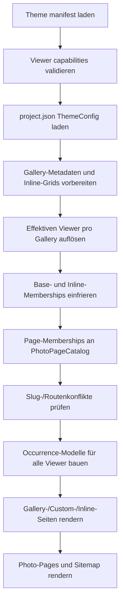

# Implementierungsplan: Theme-fähige Photo Viewer

> **Stand:** 2026-08-27
> **Status:** Implementiert am 2026-08-27
> **Abhängigkeit:** Baut auf der vorbereiteten Inline-Gallery-/Photo-Membership-Pipeline auf.
> **Ziel:** Die implizite Kopplung `Default Body = Photo-Page`, `Custom Body = kein Viewer`
> vollständig durch einen expliziten, vom Theme angebotenen Viewer-Vertrag ersetzen.

## Produktentscheidungen

Diese Punkte gelten als entschieden und sollen während der Implementierung nicht erneut implizit
umgedeutet werden:

1. Revela kennt genau die Viewer-Semantiken `page`, `lightbox` und `none`.
2. Ein Theme unterstützt eine beliebige Teilmenge davon und deklariert einen Default.
3. Der Nutzer kann den Theme-Default im Projekt und pro Seite/Galerie überschreiben.
4. Die Auflösung lautet `Seite -> Projekt -> Theme-Default`.
5. Das verwendete Body-Template beeinflusst den Viewer nicht.
6. Der Viewer gilt für die gesamte Seite einschließlich aller `[[gallery]]`-Blöcke.
7. Einzelne Inline-Tokens erhalten keinen eigenen Viewer-Override.
8. Der Viewer gehört zur Bildvorkommnis-/Membership-Ebene, nie zur kanonischen Bildidentität.
9. Sobald mindestens eine Membership eines Bildes `page` verwendet, existiert genau eine
   kanonische Photo-Page. Deren Kontexte enthalten nur `page`-Memberships.
10. `lightbox` und `none` verlinken nicht still auf eine eventuell durch eine andere Membership
    vorhandene Photo-Page.
11. Theme-Extensions erweitern oder überschreiben die Viewer-Fähigkeiten des Basis-Themes nicht.
12. Nicht unterstützte oder ungültige Modi brechen den Build vor dem ersten Output-Write mit einer
    verständlichen Diagnose ab. Es gibt keinen stillen Fallback.
13. Alle sichtbaren Grids einer Seite verwenden exakt denselben aufgelösten Viewer-Modus. Gemischte
  Modi sind nur zwischen verschiedenen Seiten möglich.
14. Photo-Memberships entstehen aus vorgesehenen sichtbaren Grid-Flächen, nicht pauschal aus allen
  `Gallery.Images` einer Custom-Body-Seite.

## Konfigurationsvertrag

### Theme-Manifest

Ein Basis-Theme deklariert seine Fähigkeiten in `manifest.json` beziehungsweise `theme.json`:

```json
{
  "photoViewers": ["page", "lightbox", "none"],
  "defaultPhotoViewer": "page"
}
```

Regeln:

- Die beiden Capability-Felder müssen bei Basis-Themes gemeinsam vorhanden sein;
  `photoViewers` enthält mindestens einen Wert.
- `defaultPhotoViewer` muss in `photoViewers` enthalten sein.
- Doppelte Werte werden als ungültiger Theme-Vertrag abgelehnt.
- Theme-Extensions lassen beide Capability-Felder weg. Deklariert eine Extension eines davon,
  ist ihr Vertrag ungültig, statt einen bedeutungslosen Default zu erzwingen.
- `page` setzt voraus, dass `Body/Photo.revela` auflösbar ist.
- `lightbox` ist ein Versprechen des Themes. Der Core kann nur den Manifestvertrag validieren;
  Markup, Tastaturbedienung und Accessibility werden durch Theme-Conformance-Tests geprüft.
- `none` ist ein expliziter Modus, nicht die Abwesenheit einer Konfiguration.

### Projekt

Der optionale Projekt-Override lebt bei der Theme-Auswahl:

```json
{
  "theme": {
    "name": "Lumina",
    "photoViewer": "page"
  }
}
```

Fehlt `theme.photoViewer`, gilt der Theme-Default.

### Seite oder Galerie

Der optionale Override steht in `_index.revela`:

```text
+++
photo_viewer = "lightbox"
+++
```

Fehlt `photo_viewer`, gilt der Projekt-Override beziehungsweise Theme-Default. Der Wert wird
case-insensitive gelesen, aber in Diagnosen und Template-Kontexten kanonisch kleingeschrieben.

## Ziel-Datenfluss



Wichtige Invarianten:

- Frontmatter und Inline-Auswahlen werden weiterhin nur einmal vorbereitet.
- Der effektive Viewer wird einmal pro Gallery und Build aufgelöst und eingefroren.
- `PhotoPageCatalog` sieht nur `page`-Memberships.
- Lightbox-Reihenfolge und Photo-Page-Reihenfolge stammen aus denselben eingefrorenen
  Memberships.
- Kein Template errät Fähigkeiten anhand von Dateinamen, Body-Template oder vorhandenen URLs.

## Zielmodelle

### Öffentlicher SDK-Vertrag

Neue Datei `src/Sdk/Models/PhotoViewerMode.cs`:

```csharp
public enum PhotoViewerMode
{
    Page,
    Lightbox,
    None
}
```

Der JSON-Konverter liest die Manifestwerte case-insensitive als Strings. Die endliche Enum ist
bewusst öffentlich: Themes wählen eine Teilmenge der von Revela verstandenen Semantiken, erfinden
aber keine Modi, deren Build-Verhalten der Core nicht kennen kann.

`ThemeManifest` erhält eine nullable Capability-Gruppe:

```csharp
public PhotoViewerCapabilities? PhotoViewer { get; init; }

public sealed class PhotoViewerCapabilities
{
  public required IReadOnlyList<PhotoViewerMode> Supported { get; init; }
  public required PhotoViewerMode Default { get; init; }
}
```

`ThemeJsonConfig` liest die zwei flachen JSON-Felder nullable ein. Embedded- und Local-Theme-
Loader bilden daraus nur bei einem Basis-Theme die gruppierte Runtime-Capability. Basis-Theme-
Validierung verlangt die Gruppe; Extension-Validierung verbietet sie. Loader müssen für
Extensions keinen künstlichen Default erfinden.

`ThemeConfig` erhält:

```csharp
public PhotoViewerMode? PhotoViewer { get; set; }
```

### Private Generate-Modelle

`DirectoryMetadata` trägt den rohen optionalen Frontmatter-Wert `PhotoViewer`. Die
source-located Umwandlung in `PhotoViewerMode` erfolgt während der Preparation, weil dort der
Dateipfad bekannt ist.

`PreparedGalleryMetadata` erhält den finalen `PhotoViewerMode ViewerMode`.

`PhotoMembership` erhält `PhotoViewerMode ViewerMode`. Vor `PhotoPageCatalog.Build` werden nur
Memberships mit `ViewerMode == Page` übergeben. `PhotoContext` benötigt daher keinen Viewer-Modus.

`GalleryImageOccurrence` entwickelt den bestehenden `LinkToPhotoPage`-Record zu einem neutralen
Render-Modell weiter:

```csharp
internal sealed record GalleryImageOccurrence(
    Image Image,
    string ViewerMode,
    string ContextId,
    string OccurrenceId,
    string? PreviousOccurrenceId,
    string? NextOccurrenceId);
```

Das interne Config-/Membership-Modell verwendet weiterhin die typisierte Enum. Das
source-generierte Scriban-Modell exportiert dagegen bewusst den kanonischen lowercase String
`page`, `lightbox` oder `none`; es verlässt sich nicht auf Enum-Namen oder den JSON-Konverter.
Manifest-JSON-Konvertierung, `IConfiguration`-Binding und Template-Konvertierung werden getrennt
getestet.

`ContextId` und `OccurrenceId` existieren in allen Modi stabil. Bei `page` selektiert `ContextId`
den Photo-Page-Kontext. Bei `lightbox` verwendet das Theme die occurrence-genauen, opaken IDs für
Dialog und Previous/Next. Die ID-Namen schreiben weder Fragmentnavigation noch ein konkretes
Lightbox-Markup vor. `none` darf die ID für Rücksprünge oder Styling behalten, erzeugt aber keine
Interaktion.

## Membership-Semantik

Memberships entsprechen vorgesehenen sichtbaren Grid-Flächen:

- Der Default-Gallery-Body ohne Inline-Token erzeugt eine Base-Membership für sein Trailing Grid.
- Ein nacktes `[[gallery]]` erzeugt dieselbe Base-Membership genau einmal, auch bei Wiederholung.
- Jedes gefilterte Inline-Grid erzeugt eine eigene Membership mit `GridNumber`.
- Ein Custom Body ohne Inline-Grid erzeugt keine Membership allein aufgrund gefüllter
  `Gallery.Images`.
- Ein Custom Body mit nacktem oder gefiltertem Inline-Grid erzeugt nur die jeweils sichtbaren
  Memberships.

Ein späterer expliziter Publish-Mechanismus für Custom Templates wäre ein eigenes Feature. Der
Viewer-Modus allein veröffentlicht keine unsichtbaren Bilder.

Alle Memberships einer Gallery erben denselben effektiven Viewer. Daraus folgt:

- `page`: Base- und gefilterte Memberships erzeugen Photo-Kontexte und gegebenenfalls Seiten.
- `lightbox`: Base- und gefilterte Memberships liefern nur occurrence-genaue Lightbox-Ketten.
- `none`: Base- und gefilterte Memberships liefern statische Occurrences.

Custom Bodies werden nicht mehr grundsätzlich ausgeschlossen. Ihre tatsächlich vorbereiteten
Inline-Grids können mit `page` Photo-Pages erzeugen, mit `lightbox` Dialogketten liefern oder mit
`none` statisch bleiben. Ein Custom Body ohne Grid publiziert keine versteckten Bilder. Dadurch
ersetzt die neue Regel D6 vollständig, ohne den Manifestpool pauschal öffentlich zu machen.

## Arbeitspakete

### Phase 0: CSS-Baseline für beide DOM-Varianten

**Ziel:** Das Lumina-River-Flow-Layout funktioniert sowohl mit Link als auch ohne Link, bevor neue
Viewer-Modi hinzukommen.

Datei:

- `src/Themes/Lumina/Assets/main.css`

Änderung:

```css
.gallery > article {
  min-width: 0;

  > a {
    display: contents;
  }

  picture {
    width: 100%;
    min-width: 0;
  }
}
```

Die bestehenden `aspect-ratio`-, Sticky- und LQIP-Regeln bleiben auf `picture` anwendbar. Keine
Selektoren verwenden, die ausschließlich `article > picture` oder ausschließlich
`article > a > picture` voraussetzen.

Fokussierte Abnahme:

- Website-Homepage: unlinked Custom-Body-Grid, kein horizontaler Overflow.
- Showcase Landscapes: verlinktes Grid, keine Geometrieänderung außer Beseitigung des Overflows.
- OneDrive Fireworks: Hochformat-Mix bleibt im River Flow.
- Desktop `1440x900` und Mobile `390x844`.
- `document.documentElement.scrollWidth <= clientWidth`.
- Grid endet vor dem nachfolgenden Content; keine Überlagerung.

Diese Browser-Abnahme ist zunächst ein verbindliches manuelles Protokoll, da das Repository noch
keinen Playwright-Test-Runner besitzt. Pro Seite werden URL, Viewport, `scrollWidth`, `clientWidth`,
Grid-Rechteck und erste Item-Rechtecke protokolliert. Ein automatisierter Browser-Harness ist ein
separates Infrastruktur-Arbeitspaket und keine Voraussetzung für den CSS-Fix.

### Phase 1: SDK- und Theme-Manifest-Vertrag

**Dateien:**

- `src/Sdk/Models/PhotoViewerMode.cs` neu
- `src/Sdk/Abstractions/ThemeManifest.cs`
- `src/Sdk/Themes/ThemeJsonConfig.cs`
- `src/Sdk/Themes/EmbeddedTheme.cs`
- `src/Core/Themes/LocalThemeProvider.cs`
- `src/Features/Generate/Services/Checks/ThemeCheck.cs`
- `src/Features/Generate/Services/Checks/ConfigCheck.cs`
- `src/Themes/Lumina/manifest.json`
- alle Test-/Fake-Themes, die `ThemeManifest` konstruieren

**Schritte:**

1. Enum und trim-sichere String-JSON-Konvertierung ergänzen.
2. Manifestfelder durch `ThemeJsonConfig` bis `ThemeManifest` führen.
3. Basis-Theme-Vertrag in einem wiederverwendbaren Validator prüfen: Gruppe vorhanden, nicht leer,
  Default enthalten, keine Duplikate; bei Extensions muss die Gruppe fehlen.
4. Bei `page` die Auflösbarkeit von `Body/Photo.revela` vor dem ersten Write prüfen.
5. Validator aus `RenderService` und `ThemeCheck` verwenden; effektive Config zusätzlich in
  `ConfigCheck` prüfen.
6. Theme-Extensions von der Capability-Auflösung ausschließen.
7. Lumina zunächst mit allen drei Modi und Default `page` deklarieren.
8. Lokale Themes über `theme.json` gleichwertig behandeln.

**Tests:**

- Embedded Theme deserialisiert alle Modi und Default.
- Local Theme deserialisiert denselben Vertrag.
- Fehlender/leerer Capability-Vertrag schlägt klar fehl.
- Default außerhalb der Liste schlägt fehl.
- Doppelte Modi schlagen fehl.
- `page` ohne `Body/Photo.revela` schlägt vor Output fehl.
- Extension-Felder verändern den Basisvertrag nicht.

### Phase 2: Projekt- und Frontmatter-Auswahl

**Dateien:**

- `src/Sdk/Configuration/ThemeConfig.cs`
- `src/Features/Generate/Models/DirectoryMetadata.cs`
- `src/Features/Generate/Infrastructure/RevelaParser.cs`
- `tests/Commands/Generate/Parsing/RevelaParserTests.cs`
- neue fokussierte Resolver-Tests unter `tests/Commands/Generate/Services/`

**Schritte:**

1. `ThemeConfig.PhotoViewer` als nullable Enum ergänzen.
2. `photo_viewer` als optionalen Frontmatter-String lesen und in `HasMetadata` berücksichtigen.
3. Eine kleine interne `PhotoViewerResolver`-Klasse anlegen.
4. Auflösung exakt `page override -> project override -> theme default` implementieren.
5. Frontmatter-Werte case-insensitive normalisieren.
6. Ungültige Frontmatter-Werte mit `_index.revela`-Pfad und Feldnamen melden.
7. Nicht unterstützte gültige Werte mit Theme-Name und unterstützter Liste melden.
8. Projektkonfigurationsfehler als Config-Fehler melden, nicht als Templatefehler.

**Tests:**

- Jede der drei Ebenen allein.
- Jede höhere Ebene überschreibt die darunterliegende.
- Alle drei Modi.
- Ungültiger String.
- Gültiger, aber vom Theme nicht unterstützter Modus.
- Root-Gallery und normale Gallery verwenden dieselbe Auflösung.
- Wiederholter Render mit geändertem `IOptionsMonitor<ThemeConfig>` verwendet den neuen Wert.

### Phase 3: Preparation und Memberships umstellen

**Dateien:**

- `src/Features/Generate/Services/RenderService.cs`
- `src/Features/Generate/Infrastructure/PhotoPageCatalog.cs`
- `src/Features/Generate/Services/GalleryBlockContext.cs`
- gegebenenfalls `src/Features/Generate/Models/PhotoContext.cs`

**Schritte:**

1. Effektiven Viewer nach dem Parsen jeder `_index.revela` in `PreparedGalleryMetadata` einfrieren.
2. Template-basierte `PhotoPageCatalog.IsEligible`-Entscheidung entfernen.
3. Die bestehende Prepared-/Membership-Pipeline weiterentwickeln, keine zweite Abstraktion
  einführen.
4. Memberships nur für das Default-Trailing-Grid oder tatsächlich vorhandene bare/filtered
  Inline-Grids in Dokumentreihenfolge bauen.
5. Viewer-Modus auf jede Membership übertragen; alle Memberships einer Prepared Gallery müssen
  denselben Modus tragen.
6. Nur `page`-Memberships an `PhotoPageCatalog.Build` geben.
7. Nackte Tokens weiterhin nicht als zweite Membership zählen.
8. Context IDs, occurrence-genaue IDs und Previous/Next aus der eingefrorenen Reihenfolge bauen.
9. Slug-Konflikte, Progress-Gesamtzahl und Sitemap ausschließlich aus den tatsächlich erzeugten
   Photo-Pages ableiten.
10. Den bisherigen `photoTemplate is present`-Feature-Schalter durch Capability-Validierung
   ersetzen. Die Datei bleibt notwendiger Theme-Vertrag für `page`, entscheidet aber nicht mehr
   selbst über den Modus.

**Tests in `PhotoPageCatalogTests`:**

- Nur `page`-Memberships erzeugen Seiten und Kontexte.
- Reine `lightbox`-/`none`-Memberships erzeugen keine Seiten.
- Dasselbe Bild in `page` und `lightbox` erzeugt eine Seite mit nur dem `page`-Kontext.
- Zwei `page`-Memberships bleiben zwei geordnete Kontexte.
- Custom Body mit sichtbarem bare/filtered Inline-Grid und `page` erzeugt Seiten.
- Custom Body mit `lightbox`/`none` erzeugt keine Seiten.
- Custom Body ohne Inline-Grid erzeugt auch bei effektivem `page` keine Seiten.
- Nacktes Grid verdoppelt den Base-Kontext nicht.
- Gefilterte Grids behalten getrennte Ketten.
- Root-Gallery, leere Menge und überlappende Grids.

### Phase 4: Einheitliches Occurrence-Template-Modell

**Ziel:** Trailing Grid, nacktes Inline-Grid und gefilterte Inline-Grids verwenden denselben
Theme-Vertrag. Kein globales `photo_links_available` und kein boolesches Sondermodell mehr.

**Dateien:**

- `src/Features/Generate/Services/GalleryBlockContext.cs`
- `src/Features/Generate/Services/RenderService.cs`
- `src/Themes/Lumina/Body/Gallery.revela`
- `src/Themes/Lumina/Partials/GalleryGrid.revela`
- `src/Themes/Lumina/Partials/Image.revela`
- lokale Sample-Overrides von `GalleryGrid.revela`

**Schritte:**

1. Base-Occurrences einmal pro Gallery aus der Base-Membership vorbereiten.
2. `occurrences` zusätzlich zu `images` in jeden Layout-Kontext geben. `images` bleibt das
   neutrale Bildmodell; `occurrences` ist der Viewer-Vertrag.
3. Lumina `Gallery.revela` und `GalleryGrid.revela` über Occurrences rendern.
4. `Image.revela` erhält den gesamten Occurrence-Zustand explizit.
5. `LinkToPhotoPage` und `photo_links_available` entfernen.
6. Kein Theme berechnet Viewer-Verfügbarkeit aus `gallery.template` oder aus dem Vorhandensein
   einer Photo-Page.
7. Für Custom Templates dokumentieren: interaktive Gallery-Ausgabe verwendet `occurrences`, reine
   Bilddaten verwenden weiterhin `images`.

**Template-Contract:**

- `occurrence.image`
- `occurrence.viewer_mode`
- `occurrence.context_id`
- `occurrence.occurrence_id`
- `occurrence.previous_occurrence_id`
- `occurrence.next_occurrence_id`

### Phase 5: Lumina-Modi implementieren

#### `page`

- Thumbnail-Link zeigt auf `page_url(image)#ctx-{context_id}`.
- Photo-Page verwendet die vorhandenen Previous/Back/Next-Kontexte.
- Canonical, Sitemap und Route bleiben unverändert.

#### `none`

- Nur responsives `<picture>`.
- Kein interaktiver Wrapper, kein falsches `role`, kein `tabindex`.
- Occurrence-Anker bleibt eindeutig.

#### `lightbox`

Lumina verwendet als Referenzimplementierung das native `<dialog>`-Element plus einen kleinen,
theme-eigenen Controller. Der Browser übernimmt Modalität, Escape und Fokusgrundverhalten; Revela
implementiert keine globale Lightbox-Engine.

Geplante Theme-Dateien:

- `src/Themes/Lumina/Partials/Image.revela`
- `src/Themes/Lumina/Partials/PhotoLightbox.revela` neu
- `src/Themes/Lumina/Assets/lightbox.js` neu
- `src/Themes/Lumina/Assets/main.css` oder separates unscoped `lightbox.css`
- `src/Themes/Lumina/manifest.json`

Lightbox-Abnahme:

- Thumbnail ist ein echter Button oder Link mit verständlichem Accessible Name.
- Öffnen fokussiert den Dialog; Schließen stellt den Trigger-Fokus wieder her.
- Escape und sichtbarer Close-Button schließen.
- Previous/Next folgt der Membership-Reihenfolge ohne Wraparound.
- Pfeiltasten sind optional, falls implementiert aber dokumentiert und getestet.
- Body-Scroll ist im offenen Dialog blockiert.
- Mehrere gefilterte Grids mit demselben Bild haben eindeutige Dialog-IDs.
- Ohne JavaScript bleibt das Thumbnail sichtbar und die Seite benutzbar; kein toter Link.
- `prefers-reduced-motion` deaktiviert Lightbox-Animationen.
- Keine Photo-Page wird allein wegen einer Lightbox-Membership erzeugt.

### Phase 6: Theme-Konfiguration und CLI-Ergonomie

**Dateien:**

- `src/Features/Theme/Commands/ConfigThemeCommand.cs`
- `src/Features/Theme/Services/ThemeService.cs`
- `src/Sdk/Services/IThemeService.cs`
- Theme-Info-/Result-Modelle, über die Commands Capabilities anzeigen und auswählen
- zugehörige Theme-Service-/Command-Tests

**Schritte:**

1. Optionales `--viewer page|lightbox|none` für nicht-interaktive Nutzung ergänzen.
2. Interaktiv nur die vom gewählten Theme unterstützten Modi anbieten.
3. `--viewer` ohne `--set` ändert den Viewer des aktuellen Themes; die bestehende Same-Theme-
  Abkürzung darf eine Viewer-Änderung nicht verschlucken.
4. Beim Theme-Wechsel einen vorhandenen Projekt-Override beibehalten, wenn er unterstützt wird.
5. Ist er nicht unterstützt, muss die interaktive Nutzung explizit neu wählen. Nicht-interaktive
  Nutzung schlägt atomar fehl, bis `--viewer <mode>` oder `--clear-viewer` beziehungsweise
  `--viewer theme-default` explizit angegeben wird.
6. Unsupported Values schreiben weder Theme noch Viewer teilweise.
7. `ThemeService.SetActiveThemeAsync` darf beim Schreiben des Theme-Namens nicht versehentlich
   andere `theme`-Felder wie `images` oder `photoViewer` löschen.
8. Ausgabe nennt Theme, effektiven Viewer und ob er aus Theme-Default oder Projekt-Override stammt.

### Phase 7: Dokumentation und Samples

**Dokumentation:**

- `docs/inline-galleries.md`: Planstatus auf implementiert setzen, D6 entfernen.
- Theme-Entwicklerdoku: Manifestfelder, Capability-Regeln und Occurrence-Vertrag.
- Konfigurationsdoku: `theme.photoViewer` und `photo_viewer`.
- Lumina README: alle unterstützten Modi und UX-Verhalten.
- Release Notes: Breaking Theme SDK/Template Contract deutlich nennen.

**Samples:**

- `samples/showcase`: globaler Default `page`, mindestens eine Gallery mit `lightbox`, eine mit
  `none`, und dasselbe Bild in gemischten Modi.
- `samples/revela-website`: Homepage explizit auf den gewünschten Modus setzen; nicht mehr vom
  `home`-Template ableiten.
- `samples/onedrive`: Default-`page`-Pfad und verschachtelte Gallery-Kontexte prüfen.
- `samples/calendar`: keine Gallery, unverändertes Rendering sicherstellen.
- Alle lokalen `GalleryGrid.revela`-Overrides auf den finalen Occurrence-Vertrag aktualisieren.

## Vollständige Testmatrix

### Manifest und Konfiguration

- Embedded und lokale Themes.
- Alle gültigen Modi, case-insensitive Eingabe.
- Fehlender, leerer, doppelter und inkonsistenter Manifestvertrag.
- Projekt- und Page-Override mit korrekter Präzedenz.
- Unsupported Mode mit Theme-Name und erlaubten Werten.
- Theme-Wechsel mit kompatiblem und inkompatiblem Override.

### Memberships und Publikation

- Base, bare und filtered.
- Default Body und Custom Body.
- Custom Body ohne Grid publiziert keine Bilder.
- Root und verschachtelte Galleries.
- Leere Filtertreffer.
- Dasselbe Bild in mehreren Grids und Modi.
- `page + lightbox`, `page + none`, `lightbox + none`.
- Stabile Reihenfolge, Filename-Tiebreaker und `limit` bleiben unverändert.
- Keine doppelten Context IDs, Anker oder Dialog-IDs.

### Rendering

- `page`: Link vorhanden und Zielseite existiert.
- `lightbox`: Dialog vorhanden, kein Photo-Href an dieser Occurrence.
- `none`: weder Link noch Dialogtrigger.
- Kein gerendertes internes Photo-Href ohne Zieldatei.
- Kein Token behält das Trailing Grid.
- Inline-Token unterdrückt Trailing Grid auch bei null Treffern.
- Themes ohne Inline-Partial bleiben ohne Token funktionsfähig.

### Accessibility und Layout

- Tastaturbedienung, Escape, Fokus-Rückgabe und Accessible Names für Lumina-Lightbox.
- `prefers-reduced-motion`.
- Desktop und Mobile ohne horizontalen Overflow.
- River Flow mit und ohne `<a>` beziehungsweise Lightbox-Trigger.
- Nachfolgender Content wird nicht vom Sticky-Grid überlagert.

Bis ein Browser-Test-Harness existiert, werden diese Punkte als manuelles Protokoll mit dem
agent-gesteuerten Browser geprüft: JavaScript an/aus, `prefers-reduced-motion: reduce`, reine
Tastaturbedienung, Desktop `1440x900`, Mobile `390x844`, Duplicate-ID-Scan und Geometriemessung.

### SEO und Build

- Nur erzeugte Photo-Pages erscheinen in Sitemap und Progress-Gesamtzahl.
- Canonical bleibt fragmentfrei.
- Slug-/Routenkonflikte werden vor Output erkannt.
- Reine Lightbox-/None-Sites erzeugen kein leeres `output/photo`.
- Wiederholter Build ist deterministisch und idempotent.

## Validierungsreihenfolge

Nach jedem Arbeitspaket den engsten Test ausführen. Vor Abschluss seriell:

```pwsh
dotnet build
dotnet test tests/Core
dotnet test tests/Commands
dotnet test tests/Integration
dotnet format
dotnet format --verify-no-changes
```

Danach Samples:

```pwsh
Push-Location samples/showcase
dotnet run --project ../../src/Cli.Embedded -- generate pages
Pop-Location

Push-Location samples/onedrive
dotnet run --project ../../src/Cli.Embedded -- generate pages
Pop-Location

Push-Location samples/calendar
dotnet run --project ../../src/Cli.Embedded -- generate pages
Pop-Location

Push-Location samples/revela-website
dotnet run --project ../../src/Cli.Embedded -- generate pages
Pop-Location
```

Programmatische Sample-Prüfungen:

- Jedes interne `photo/`-Href hat eine `index.html`-Zieldatei.
- Keine doppelten HTML-IDs.
- Photo-Page-Anzahl entspricht den eindeutigen Bildern aus `page`-Memberships.
- Lightbox-/None-Occurrences erzeugen keine zusätzlichen Photo-Seiten.
- Repräsentative Grid-Seiten haben keinen horizontalen Overflow.

## Nicht-Ziele

- Kein Viewer-Override direkt im `[[gallery: ...]]`-Token.
- Keine frei erweiterbare Viewer-Plugin-Registry; die drei Modi haben Core-Semantik.
- Keine automatische Heading-Inferenz oder implizite Auswahl anhand des Templates.
- Kein stiller Fallback bei ungültigen Theme-Verträgen.
- Keine pauschale Veröffentlichung aller Manifestbilder ohne Gallery-/Seitenzuordnung.
- Keine Rückkehr der alten Lumina-Lightbox in den Core; sie bleibt Theme-Implementierung.

## Abschlusskriterien

- [ ] Theme-Capabilities und Default sind explizit und validiert.
- [ ] Projekt- und Page-Overrides folgen nachweislich der festgelegten Präzedenz.
- [ ] Kein Verhalten hängt mehr von `gallery.template` oder `Body/Photo.revela` als Feature-Flag ab.
- [ ] `page`, `lightbox` und `none` funktionieren in Lumina auf Default- und Custom-Body-Seiten.
- [ ] Gemischte Modi desselben Bildes erzeugen genau die erwarteten Artefakte.
- [ ] Alle Gallery-Ausgaben verwenden den einheitlichen Occurrence-Vertrag.
- [ ] River Flow funktioniert mit und ohne interaktiven Wrapper auf Desktop und Mobile.
- [ ] Photo-Links, Anker, Dialog-IDs, Sitemap und Progress sind konsistent.
- [ ] Theme-Wechsel behandelt vorhandene Viewer-Overrides verständlich.
- [ ] Theme-Entwickler- und Nutzerdokumentation sind aktuell.
- [ ] Build, Core-, Commands-, Integration- und Format-Gates sind grün.
- [ ] Showcase, OneDrive, Calendar und revela-website sind generiert und geprüft.

## Empfohlene Umsetzungseinheiten

1. CSS-Baseline separat und sofort validieren.
2. SDK-/Manifestvertrag plus Loader-Tests.
3. Config-/Frontmatter-Resolver plus Diagnosen.
4. Membership-/Catalog-Umbau plus Unit-Tests.
5. Einheitliches Occurrence-Modell plus Page-/None-E2E.
6. Lumina-Lightbox plus Accessibility-/Browser-Abnahme.
7. CLI, Dokumentation, Samples und vollständiges Gate.

Keine Commits, Tags oder Pushes ohne ausdrückliche Benutzeranweisung.